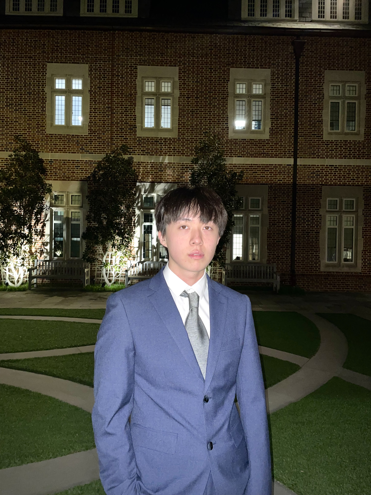

# About Me

Here is **Yuxuan Hu**. 

I am an undergraduate student in the [Vanderbilt University](https://www.vanderbilt.edu/). I am double major in physics and Mathematics. 
---

## Research Interests

- Condensed Matter Physics
- High Energy Physics

---

## News and Updates
- **May 2025：** Joined [Dr.Dia](https://mdiaslab.com/)'s lab as a research assistant, researching magnetic skyrmion generation via the Inverse Faraday Effect.
- **April/May 2025：**Presented my research [poster](/file/poster%20draft.pdf) at the [103rd Virginia Academy of Science Annual Meeting](https://vacadsci.org/2025-annual-meeting/) and the [2025 A&S Student Symposium](https://as.richmond.edu/student-research/symposium/index.html).
- **Jun 2024：** Started working as a research assistant in [Dr.Gilfoyle](https://facultystaff.richmond.edu/~ggilfoyl/GPGHome.html)'s lab, investigating neutron detection efficiency..

 

