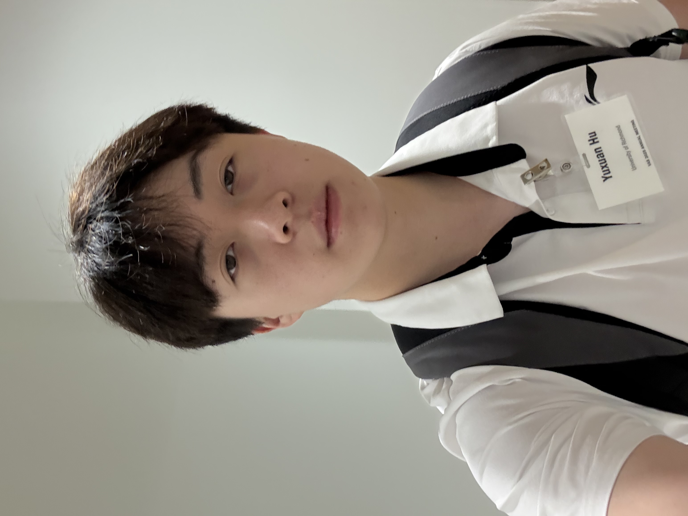

# About Me

Here is **Yuxuan Hu**. 

I am a undergraduate student in the [Vanderbilt University](https://www.vanderbilt.edu/). I am double major in physics and Mathematics. My days are filled with unraveling the mysteries of the universe through courses in classical mechanics, quantum theory, and advanced calculus, while nights often find me coding simulations or sketching diagrams to visualize the elegance of mathematical proofs.

---

## Research Interests

- Condensed Matter Physics
- High Energy Physics

---

## News and Updates

- **May 2025**：Delighted to be selected as a winner of the 2025 Cambridge-CSC Scholarship!
- **June 2024**：Very excited to be selected as [KDD UC Scholar](https://kdd2024.kdd.org/undergraduate-consortium/). See you in Spain!
- **April 2024：**Our work *BLEGuard* has been accepted to [MobiSys 2024](https://www.sigmobile.org/mobisys/2024/) as a poster paper. See you in Japan!
- **March 2024：**Presented my research [poster] on A&S Symposium
- **Jun 2024：** Started working as a research assistant in [Dr.Gilfoyle](https://facultystaff.richmond.edu/~ggilfoyl/GPGHome.html)'s lab.

 

